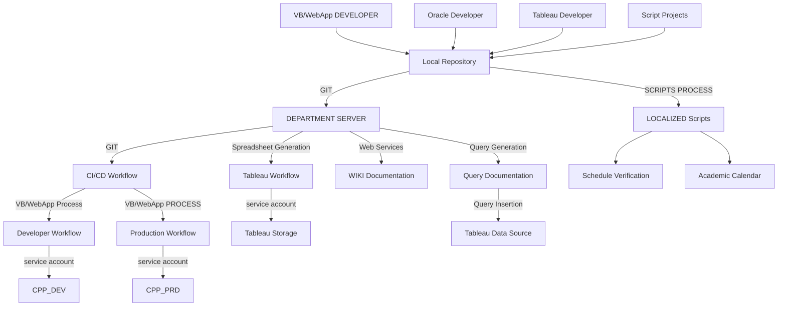

# Department Server Justification Document

## Purpose of the Server
The central server is essential for:
- **Code Storage**: A secure repository for all project code.
- **Documentation**: Maintaining a detailed log of code changes, including authorship and purpose.
- **Deployment**: Facilitating efficient and cautious workflows for web app updates.
- **Security**: Providing controlled access to code libraries and reducing single points of failure.
- **Automation**: Enabling hands-off data updates and scheduled processes.

## Systems Supported
The server will support the following systems and applications:
- **Web Applications for Academic Programs**: Hosting and managing web apps like Acalog and Curriculog.
- **Version Control**: Centralized version control for all projects using Git and Gitea.
- **Documentation**: Storing and managing project documentation.
- **Server Access Support**: Providing secure and efficient access for team members.

## Required Features
The server must include:
- **Service Accounts**: For scheduling processes without personal accounts.
- **Version Control**: Git and Gitea for managing code repositories.
- **Backup Systems**: Regular backups of server data and software.
- **Firewall and Security**: Tools like Fail2Ban and UFW to enhance security.
- **SFTP and SSH**: For secure file transfers and remote access.
- **Web Server**: Nginx for hosting and testing environments.

## Importance and Benefits
- **Legitimacy**: IT control ensures proper support and compliance.
- **Backup and Recovery**: Protects against data loss and hardware failure.
- **Documentation**: Enforces detailed records of project changes.
- **Onboarding**: Simplifies knowledge transfer for new team members.
- **Efficiency**: Streamlines workflows and automates repetitive tasks.

## Risks of Current Infrastructure
The current setup poses significant risks:
- **Single Point of Failure**: The existing server is outdated and lacks redundancy.
- **No Backup**: Data is at risk of permanent loss.
- **Uncontrolled Access**: Physical access to the server is not secure.
- **Aging Hardware**: The current server is unreliable and unsustainable.

## Implementation Phases
To ensure a smooth transition, the following phases are proposed:
1. **Provision IT-Supported Server**: Set up a new server or VM with designated technical access.
2. **Configure Service Accounts**: Enable scheduled processes using service accounts.
3. **Support Required Applications**: Ensure compatibility with Python, SFTP, and other tools.
4. **Repurpose Existing Server**: Use the old server as a backup or sandbox environment.
5. **Set Up Version Control**: Implement Git and Gitea for centralized code management.

## Visuals and Software List
### Workflow Diagram
Refer to the provided Mermaid diagram for a detailed workflow illustration.

### Required Software
- **Nginx**: Web server.
- **Git**: Version control system.
- **Gitea**: Web-based Git interface.
- **OpenSSH**: Secure shell and file transfer.
- **Samba**: File services.
- **Fail2Ban**: Firewall enhancement.
- **UFW**: Firewall configuration.

---

This document outlines the justification for a department-level server, ensuring clarity and accessibility for both management and technical staff.

---

